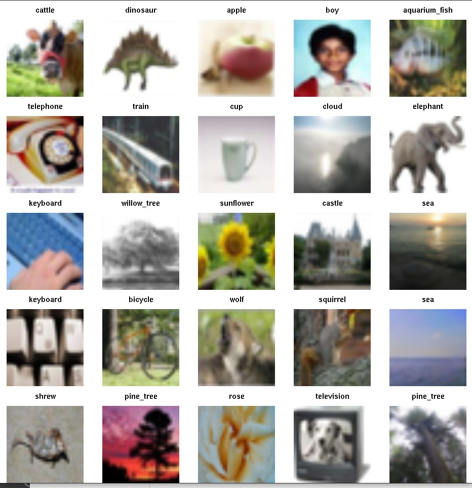

# littleDeep

The purpose of this package is to focus on a little bit of material
presented in James et al. [Introduction to Statistical Learning with R (ISLR)](https://www.statlearning.com/).

We want to think about the old approach to statistical modeling
```
Data = Fit + Residual
```
but now the `Data` are



Take a look at the Articles tab at [https://vjcitn.github.io/littleDeep](https://vjcitn.github.io/littleDeep)
to learn more.
