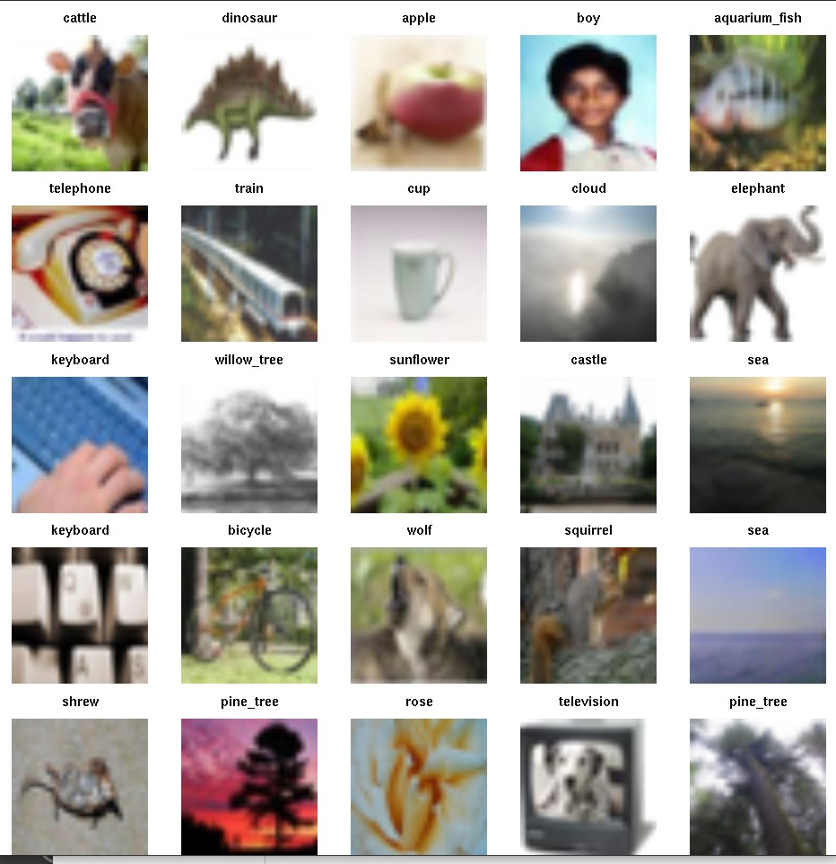

# Introduction

The purpose of this package is to focus on a little bit of material
presented in James et al. [Introduction to Statistical Learning with R (ISLR)](https://www.statlearning.com/).

We want to think about the old approach to statistical modeling
```
Data = Fit + Residual
```
but now the `Data` are



and it is not particularly clear what `Fit` and `Residual` might be.

# Chapter 10 Convolutional Neural Net with keras

The code of a [keras-based](https://keras.io) model is given
among the 
[resources for ISLR](https://hastie.su.domains/ISLR2/Labs/Rmarkdown_Notebooks/Ch10-deeplearning-lab-keras.Rmd)

```
model <- keras_model_sequential() %>%
   layer_conv_2d(filters = 32, kernel_size = c(3, 3),
      padding = "same", activation = "relu",
      input_shape = c(32, 32, 3)) %>%
   layer_max_pooling_2d(pool_size = c(2, 2)) %>%
   layer_conv_2d(filters = 64, kernel_size = c(3, 3),
      padding = "same", activation = "relu") %>%
   layer_max_pooling_2d(pool_size = c(2, 2)) %>%
   layer_conv_2d(filters = 128, kernel_size = c(3, 3),
      padding = "same", activation = "relu") %>%
   layer_max_pooling_2d(pool_size = c(2, 2)) %>%
   layer_conv_2d(filters = 256, kernel_size = c(3, 3),
      padding = "same", activation = "relu") %>%
   layer_max_pooling_2d(pool_size = c(2, 2)) %>%
   layer_flatten() %>%
   layer_dropout(rate = 0.5) %>%
   layer_dense(units = 512, activation = "relu") %>%
   layer_dense(units = 100, activation = "softmax")
```

To compile, fit, and record the optimization processes
of fitting the model, the code is

```
model %>% compile(loss = "categorical_crossentropy",
    optimizer = optimizer_rmsprop(), metrics = c("accuracy"))
history <- model %>% fit(x_train, y_train, epochs = 10,
    batch_size = 128, validation_split = 0.2)
```
The Rmd and book report the accuracy of this approach at 46%

The purpose of this package is to help newcomers (like me)
explore this approach to statistical learning.  I'm particularly
interested in how we can tune the model, appraise its
performance in a comparative context, accelerate the
fitting using a GPU, and measure the activity of the GPU
as it does its job.  We'll eventually produce dockerfiles
to help with the GPU-related activities, as it can be
challenging to configure the drivers and software to
take advantage of GPUs.

# Chapter 10 Convolutional Neural Net with torch

At the end of April 2023 I noted that the authors provide a new
torch-based approach.  The code is now
```
conv_block <- nn_module(
  initialize = function(in_channels, out_channels) {
    self$conv <- nn_conv2d(
      in_channels = in_channels, 
      out_channels = out_channels, 
      kernel_size = c(3,3), 
      padding = "same"
    )
    self$relu <- nn_relu()
    self$pool <- nn_max_pool2d(kernel_size = c(2,2))
  },
  forward = function(x) {
    x %>% 
      self$conv() %>% 
      self$relu() %>% 
      self$pool()
  }
)

model <- nn_module(
  initialize = function() {
    self$conv <- nn_sequential(
      conv_block(3, 32),
      conv_block(32, 64),
      conv_block(64, 128),
      conv_block(128, 256)
    )
    self$output <- nn_sequential(
      nn_dropout(0.5),
      nn_linear(2*2*256, 512),
      nn_relu(),
      nn_linear(512, 100)
    )
  },
  forward = function(x) {
    x %>% 
      self$conv() %>% 
      torch_flatten(start_dim = 2) %>% 
      self$output()
  }
)
model()
```

Compile, fit and evaluate with
```
fitted <- model %>% 
  setup(
    loss = nn_cross_entropy_loss(),
    optimizer = optim_rmsprop, 
    metrics = list(luz_metric_accuracy())
  ) %>% 
  set_opt_hparams(lr = 0.001) %>% 
  fit(
    train_ds,
    epochs = 10, #30,
    valid_data = 0.2,
    dataloader_options = list(batch_size = 128)
  )

print(fitted)

evaluate(fitted, test_ds)
```
[This Rmd](https://hastie.su.domains/ISLR2/Labs/Rmarkdown_Notebooks/Ch10-deeplearning-lab-torch.Rmd) 
reports the accuracy at 36%.
